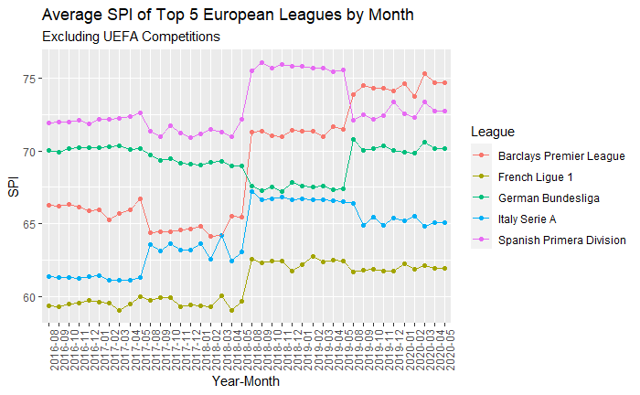
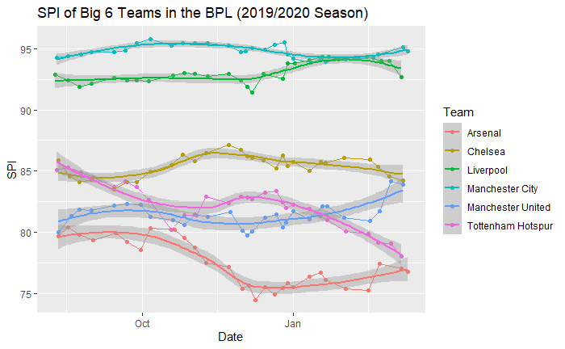

More to come...

In this project I did an analysis of 538's Premier League (England's top domestic soccer league) data involving transformation, visualization, and a little bit of modeling. For more information visit https://github.com/ConnorCarpenterISU/DS202-538SoccerAnalysis and see some example visualizations below.

